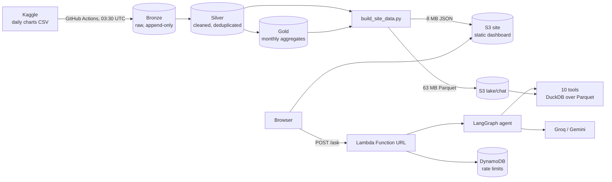

# StreamPulse

Daily Spotify chart analytics for 72 markets, served as a static dashboard plus a grounded chat assistant. It runs
serverless on AWS, refreshes itself every morning, and costs a few dollars a month at most.

**Live:** http://streampulse-site-922120357133.s3-website.ap-south-1.amazonaws.com/ (HTTP only, see [Limitations](#limitations))

| | |
|---|---|
| Data | Daily top-200 Spotify charts, 2017-01-01 to the latest day. 43.9 million chart rows, 251,278 tracks, 59,576 artists, 72 markets |
| Dashboard | Home page and 9 views: overview, world map, countries (72 pages), artists (300), tracks (500), trending, labels, seasonality, data health |
| Assistant | "Ask StreamPulse": a LangGraph agent that answers only from deterministic tools, and checks every number it states |
| Refresh | GitHub Actions, daily at 03:30 UTC. Kaggle to Bronze, Silver and Gold in S3, then the serving files, in roughly 15 minutes |
| Hosting | S3 website (static site), Lambda container (chat), DynamoDB (rate limits). No servers |

"Streams" everywhere means **charted streams**: the streams of tracks that were on a market's daily top-200 chart. It is not
total Spotify streams, royalties or monthly listeners.

## How it works



1. **Bronze (raw).** A scheduled workflow downloads the Kaggle file and appends to Bronze only the rows that are new or changed
   (row-hash comparison over a 7-day lookback). Bronze is immutable and append-only, with lineage columns (`_ingest_date`,
   `_source_file`, `_row_hash`), so every correction Kaggle ever makes is kept as a version.
2. **Silver (clean) and Gold (aggregated).** Silver is rebuilt from Bronze for the months that changed (latest version of a row wins; unmapped
   markets and duplicates are dropped; features added). Gold holds monthly aggregates built from Silver. Because Silver depends only on
   Bronze, the whole of Silver and Gold can be replayed from Bronze at any time without touching Kaggle. See [pipeline/README.md](pipeline/README.md).
3. **Serving.** `build_site_data.py` turns Gold (monthly views) and Silver (daily and track-level views) into small JSON files for the
   browser and a compact Parquet set for the chatbot, and checks that Gold reconciles with Silver. Visitors never trigger a query.
4. **Serve.** The dashboard is plain HTML, CSS and JavaScript on S3. It fetches the JSON and draws charts with Chart.js and D3.
5. **Ask.** The chat widget calls a Lambda. An agent picks tools, the tools run SQL over Parquet, the model writes a short
   answer, and a verifier rejects any figure that no tool returned.

Details: [docs/ARCHITECTURE.md](docs/ARCHITECTURE.md), [docs/CHATBOT.md](docs/CHATBOT.md), [docs/OPERATIONS.md](docs/OPERATIONS.md),
[docs/DECISIONS.md](docs/DECISIONS.md).

## The assistant in one minute

- **Numbers come from tools, not from the model.** Ten tested functions (country stats, top tracks and artists, artist and
  track profiles, comparison, monthly trend, movers, data status) return facts with links to the matching dashboard page.
- **Verification.** Every figure in an answer must trace back to a tool result (1 % tolerance, or the rounding of a displayed
  value). One rewrite is attempted, then a visible disclaimer is added.
- **Guardrails.** Obvious injection and secret requests are refused before any model call. Off-topic questions get a one-line
  refusal. Track and artist names inside tool results are treated as data, never as instructions.
- **Honest about gaps.** Markets with no recent stream counts in the source (India since 2026-08-10, where ranks continue but streams are blank; Belarus and Israel since March, where rows stop) are flagged
  in the answer.
- **Evaluated.** 38 golden questions with expected numbers computed from the raw data by independent SQL: 38 of 38 pass,
  100 % of answers verified, average 1.7 s, p95 3.5 s (see [docs/CHATBOT.md](docs/CHATBOT.md) for method and caveats).

## Repository map

```
dashboard/           static site: index.html, app.js (router, pages, charts), chat.js (assistant widget), style.css
pipeline/            refresh.py (Kaggle to Bronze, Silver, Gold), build_site_data.py (JSON + chat Parquet), tests
chatbot/             tools.py, agent.py (LangGraph), llm.py, handler.py (Lambda), Dockerfile, eval/, tests/
infra/terraform/     S3 buckets, GitHub OIDC role, budget, ECR, Lambda + Function URL, DynamoDB
.github/workflows/   daily-refresh.yml, chatbot-image.yml
docs/                architecture, chatbot, operations runbook, decisions, legacy Django notes
apps/ config/ ...    the original Django app (superseded, kept for history)
```

## Run it locally

```bash
# 1. data (one time): build the JSON and chat Parquet from a Silver copy of the lake
aws s3 sync s3://streampulse-lake-922120357133/silver /tmp/lk/silver
python pipeline/build_site_data.py --lake /tmp/lk --out /tmp/lk/site_data --chat-out /tmp/lk/chat_data

# 2. the assistant (needs GROQ_API_KEY and/or GEMINI_API_KEY in .env)
python3 -m venv chatbot/.venv && chatbot/.venv/bin/pip install -r chatbot/requirements.txt
chatbot/.venv/bin/python chatbot/serve_local.py        # site + chat on http://localhost:8787

# 3. tests and eval
chatbot/.venv/bin/python -m pytest -q chatbot/tests
cd pipeline && python -m pytest -q tests
chatbot/.venv/bin/python chatbot/eval/run_eval.py --data /tmp/lk/chat_data
```

## Cost

Estimates, not yet confirmed against a full month of billing: Lambda, DynamoDB, CloudWatch and S3 requests sit inside the free
tier at demo traffic; S3 storage (about 2.8 GB lake including Bronze, 7 MB site) and one ECR image are cents per month. A gross-usage budget of
$3 per month (credits not netted out) alerts by email. The LLM calls use free tiers (see Limitations).

## Limitations

- **HTTP only.** The site is an S3 website endpoint, which cannot serve HTTPS. CloudFront could not be created on this account.
  The chat endpoint itself is HTTPS.
- **Free-tier LLMs.** Groq and Gemini free tiers rate-limit hard. The agent falls back across a chain of models on two providers (four in the Lambda) and waits out short
  limits, but under load it can answer "busy". There is a per-IP and a daily cap so one visitor cannot exhaust it.
- **Cold starts.** The first chat question after idle takes about 10 seconds (the Lambda downloads 63 MB of data). Later ones take about 2 seconds.
- **Source data.** The Kaggle source has no stream counts for India after 2026-08-09 (ranks continue, streams are blank) and no rows at all for Belarus and Israel after March; they are shown as stale. Artist and track
  detail pages exist for the top 300 artists and top 500 tracks only. Per-country windows in the assistant are limited to 60 days.
- **Eval caveat.** The golden set is small (38) and two tool bugs were fixed after seeing its failures, so 38 of 38 is optimistic.
  It should grow with unseen questions.
- **Concurrency.** The AWS account allows 10 concurrent Lambdas, shared with another project, so a reserved-concurrency cap is not available; limits are enforced in DynamoDB.

## Provenance

The idea and the original Gold-layer design came out of a team capstone at C-DAC (PGCP-BDA). The serverless pipeline, the dashboard,
the assistant, the evaluation and the AWS deployment in this repository are my own work. The chart data is the public Kaggle dataset
`gonzalopezgil/spotify-charts-daily-updated`; Spotify is not affiliated with this project.

The first version of this project (Django, Postgres with pgvector, one EC2 box) is documented in
[docs/LEGACY_DJANGO.md](docs/LEGACY_DJANGO.md).
